# CONTEXT DIAGRAM (Sơ đồ ngữ cảnh - DFD Level 0)
## Dự án: Campus Event Management System (Campus Pulse)

Sơ đồ ngữ cảnh (Context Diagram) mô tả luồng thông tin giữa hệ thống **Campus Event Management System (Campus Pulse)** ở trung tâm và các tác nhân ngoài (External Entities) xung quanh bao gồm: **Sinh viên (Student)**, **Khoa (Department)**, **Hội đồng duyệt (Committee)**, **Quản trị viên (Admin)**, và các hệ thống bên thứ ba như **Google APIs** và **Email Service**.

---

### 1. Sơ đồ ngữ cảnh bằng Mermaid Diagram

```mermaid
flowchart TB
    %% Styling
    classDef system fill:#f25f22,stroke:#c2410c,stroke-width:4px,color:#fff,font-weight:bold;
    classDef entity fill:#f8fafc,stroke:#475569,stroke-width:2px,color:#1e293b,font-weight:bold;
    
    %% Central System Node
    System((Campus Event<br>Management System<br>Campus Pulse)):::system
    
    %% External Entity Nodes
    Student[Student<br>Sinh viên]:::entity
    Department[Department<br>Khoa / Ban Tổ chức]:::entity
    Committee[Committee<br>Hội đồng duyệt]:::entity
    Admin[Admin<br>Quản trị viên]:::entity
    Google[Google Services<br>OAuth / Forms API]:::entity
    Email[Email Service<br>SMTP Server]:::entity

    %% Student (Sinh viên) Flows
    Student -- "1. Xem danh sách & chi tiết sự kiện" --> System
    Student -- "2. Yêu cầu đăng ký (Xếp slot ưu tiên)" --> System
    Student -- "3. Quét mã QR (Check-in/Check-out)" --> System
    Student -- "4. Gửi bài quiz & đánh giá phản hồi" --> System
    System -- "a. Trả về thông tin sự kiện & trạng thái đăng ký" --> Student
    System -- "b. Gửi vé QR điểm danh" --> Student
    System -- "c. Xác nhận hoàn tất tham dự sự kiện" --> Student

    %% Department (Khoa / BTC) Flows
    Department -- "1. Gửi đề xuất sự kiện mới" --> System
    Department -- "2. Cấu hình tiêu chí ưu tiên & câu hỏi quiz" --> System
    Department -- "3. Điều khiển phiên điểm danh (Đóng/mở)" --> System
    Department -- "4. Yêu cầu báo cáo thống kê & phản hồi" --> System
    System -- "a. Thông báo trạng thái xét duyệt đề xuất" --> Department
    System -- "b. Báo cáo số liệu điểm danh & phân tích phản hồi AI" --> Department

    %% Committee (Hội đồng duyệt) Flows
    Committee -- "1. Yêu cầu danh sách đề xuất cần duyệt" --> System
    Committee -- "2. Gửi quyết định duyệt/từ chối kèm nhận xét" --> System
    System -- "a. Danh sách đề xuất sự kiện chờ duyệt" --> Committee
    System -- "b. Xác nhận lưu kết quả phê duyệt" --> Committee

    %% Admin (Quản trị viên) Flows
    Admin -- "1. Quản lý tài khoản & phân quyền vai trò" --> System
    Admin -- "2. Giám sát hoạt động & nhật ký hệ thống (Logs)" --> System
    System -- "a. Kết quả truy vấn thông tin người dùng" --> Admin
    System -- "b. Biểu đồ giám sát & log hoạt động hệ thống" --> Admin

    %% Google Services Flows
    System -- "1. Yêu cầu xác thực người dùng (Google OAuth)" --> Google
    Google -- "a. Trả về thông tin tài khoản xác thực thành công" --> Google
    System -- "2. Yêu cầu tạo Google Form khảo sát" --> Google
    Google -- "b. Đồng bộ câu trả lời/phản hồi khảo sát" --> System

    %% Email Service Flows
    System -- "1. Gửi yêu cầu phân phối Email (Vé QR/Thông báo)" --> Email
    Email -- "a. Trạng thái gửi Email thành công/thất bại" --> System
```

---

### 2. Mô tả chi tiết các Luồng Dữ liệu (Data Flows)

| Tác nhân ngoài (Entity) | Luồng Dữ liệu gửi đến Hệ thống (Inputs) | Luồng Dữ liệu nhận từ Hệ thống (Outputs) |
| :--- | :--- | :--- |
| **Student (Sinh viên)** | - Truy vấn xem danh sách/lịch trình sự kiện. - Đăng ký tham gia sự kiện (kèm thông tin ngành, kỳ học để xếp slot ưu tiên). - Gửi thông tin quét mã QR động. - Gửi phản hồi, khảo sát và câu trả lời kiểm tra cuối sự kiện. | - Hiển thị danh sách sự kiện đang mở. - Nhận vé sự kiện (QR Code Ticket) qua giao diện & Email. - Nhận kết quả xác nhận điểm danh thành công. |
| **Department (Khoa / BTC)** | - Tạo & chỉnh sửa đề xuất sự kiện mới. - Cấu hình danh sách câu hỏi kiểm tra (quiz check-out) và tiêu chuẩn ưu tiên. - Thực hiện đóng/mở phiên quét QR điểm danh. - Truy vấn dữ liệu thống kê sự kiện. | - Trạng thái duyệt đề xuất sự kiện từ Hội đồng. - Dashboard thống kê điểm danh theo thời gian thực. - Báo cáo kết quả phân tích phản hồi sinh viên (tích hợp AI phân tích cảm xúc). |
| **Committee (Hội đồng duyệt)**| - Yêu cầu hiển thị các sự kiện đang chờ phê duyệt. - Thực hiện Duyệt (Approve) hoặc Từ chối (Reject) kèm lý do và nhận xét. | - Danh sách chi tiết các đề xuất sự kiện cần xét duyệt. - Phản hồi trạng thái xử lý phê duyệt thành công. |
| **Admin (Quản trị viên)** | - Cấu hình danh sách người dùng, vai trò hệ thống. - Xem hệ thống log và số liệu vận hành kỹ thuật. | - Dữ liệu quản trị tài khoản người dùng. - Bảng giám sát hiệu năng và lịch sử ghi nhận hoạt động (Audit Logs). |
| **Google Services** | - Trả về token OAuth và dữ liệu định danh sinh viên/cán bộ. - Trả về câu trả lời khảo sát tự động từ Google Forms. | - Yêu cầu xác thực đăng nhập Google. - API tạo/cấu hình biểu mẫu Google Forms. |
| **Email Service (SMTP)** | - Gửi phản hồi kết quả chuyển phát email (Delivered/Failed). | - Dữ liệu vé điện tử QR Code, mã kích hoạt tài khoản hoặc thư nhắc nhở. |
