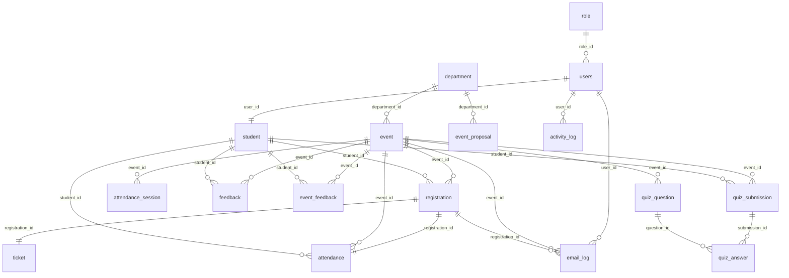

# CampusEvent - Tài liệu thiết kế cơ sở dữ liệu

> Tài liệu mô tả chi tiết thiết kế cơ sở dữ liệu của hệ thống **CampusEvent** (Academic Event
> Management System - AEMS): tổng quan, danh sách bảng, ý nghĩa từng cột, quan hệ, khóa chính,
> khóa ngoại, quy tắc dữ liệu và ghi chú migration giữa PostgreSQL và SQL Server.
>
> Tài liệu này biên soạn bám sát `src/main/resources/schema-postgresql.sql` và các entity JPA
> trong `src/main/java/com/example/model`. **Không** chỉnh sửa các file SQL gốc.

---

## Mục lục

1. [Tổng quan database](#1-tổng-quan-database)
2. [Quy ước thiết kế](#2-quy-ước-thiết-kế)
3. [Danh sách bảng](#3-danh-sách-bảng)
4. [Sơ đồ quan hệ thực thể (ERD)](#4-sơ-đồ-quan-hệ-thực-thể-erd)
5. [Bảng `role`](#5-bảng-role)
6. [Bảng `department`](#6-bảng-department)
7. [Bảng `users`](#7-bảng-users)
8. [Bảng `student`](#8-bảng-student)
9. [Bảng `event`](#9-bảng-event)
10. [Bảng `event_proposal`](#10-bảng-event_proposal)
11. [Bảng `registration`](#11-bảng-registration)
12. [Bảng `ticket`](#12-bảng-ticket)
13. [Bảng `attendance`](#13-bảng-attendance)
14. [Bảng `attendance_session`](#14-bảng-attendance_session)
15. [Bảng `feedback`](#15-bảng-feedback)
16. [Bảng `event_feedback`](#16-bảng-event_feedback)
17. [Bảng `quiz_question`](#17-bảng-quiz_question)
18. [Bảng `quiz_submission`](#18-bảng-quiz_submission)
19. [Bảng `quiz_answer`](#19-bảng-quiz_answer)
20. [Bảng `email_log`](#20-bảng-email_log)
21. [Bảng `activity_log`](#21-bảng-activity_log)
22. [Tổng hợp quan hệ và khóa ngoại](#22-tổng-hợp-quan-hệ-và-khóa-ngoại)
23. [Quy tắc dữ liệu (business rules)](#23-quy-tắc-dữ-liệu-business-rules)
24. [Chỉ mục (index) khuyến nghị](#24-chỉ-mục-index-khuyến-nghị)
25. [Ghi chú migration PostgreSQL và SQL Server](#25-ghi-chú-migration-postgresql-và-sql-server)
26. [Phụ lục: từ điển kiểu dữ liệu](#26-phụ-lục-từ-điển-kiểu-dữ-liệu)
27. [DDL tham chiếu cho SQL Server](#27-ddl-tham-chiếu-cho-sql-server)
28. [Khác biệt tên bảng / cột giữa JPA và file SQL](#28-khác-biệt-tên-bảng--cột-giữa-jpa-và-file-sql)
29. [Bảng `event_images` (tham chiếu entity)](#29-bảng-event_images-tham-chiếu-entity)
30. [Sơ đồ ERD dạng Mermaid](#30-sơ-đồ-erd-dạng-mermaid)
31. [Dữ liệu khởi tạo (seed data)](#31-dữ-liệu-khởi-tạo-seed-data)
32. [Cơ chế tạo schema khi chạy ứng dụng](#32-cơ-chế-tạo-schema-khi-chạy-ứng-dụng)
33. [Truy vấn phân tích mẫu](#33-truy-vấn-phân-tích-mẫu)
34. [Toàn vẹn dữ liệu và lưu ý vận hành](#34-toàn-vẹn-dữ-liệu-và-lưu-ý-vận-hành)
35. [Phụ lục: tổng hợp ràng buộc UNIQUE và DEFAULT](#35-phụ-lục-tổng-hợp-ràng-buộc-unique-và-default)

---

## 1. Tổng quan database

### 1.1. Vai trò của cơ sở dữ liệu

Cơ sở dữ liệu là trung tâm lưu trữ của CampusEvent, chứa toàn bộ dữ liệu nghiệp vụ: người
dùng, sinh viên, sự kiện, đề xuất, đăng ký, vé, điểm danh, quiz, phản hồi, nhật ký email và
nhật ký hoạt động.

### 1.2. Hệ quản trị cơ sở dữ liệu

Hệ thống được thiết kế để chạy trên hai hệ quản trị:

| Môi trường        | Hệ quản trị               | Ghi chú                                       |
|-------------------|---------------------------|-----------------------------------------------|
| Phát triển (dev)  | Microsoft SQL Server      | Entity dùng `columnDefinition = "NVARCHAR..."`.|
| Triển khai (prod) | PostgreSQL (Neon)         | Có file `schema-postgresql.sql` riêng.        |

Ánh xạ đối tượng-quan hệ (ORM) thực hiện qua Hibernate / Spring Data JPA. Phần lớn bảng được
tự sinh từ entity; riêng PostgreSQL có script `schema-postgresql.sql` để khởi tạo tường minh.

### 1.3. Nguồn sự thật (source of truth)

- **Cấu trúc cột chuẩn cho PostgreSQL:** `src/main/resources/schema-postgresql.sql`.
- **Cấu trúc ánh xạ JPA:** các lớp trong `src/main/java/com/example/model`.
- **Dữ liệu khởi tạo:** `database_full.sql`, `database_full_postgresql.sql`, và các lớp seeder
  (`DataSeeder`, `ProposalDataBackfill`, ...).

Tài liệu này mô tả lại cấu trúc đó. Khi có khác biệt giữa entity và schema, **schema SQL là
chuẩn cho việc tạo bảng**, còn entity quyết định hành vi ứng dụng.

### 1.4. Danh sách bảng tổng quát

Cơ sở dữ liệu gồm **17 bảng** chính:

1. `role` — vai trò người dùng.
2. `department` — khoa / phòng ban.
3. `users` — tài khoản người dùng.
4. `student` — hồ sơ sinh viên.
5. `event` — sự kiện đã công bố.
6. `event_proposal` — đề xuất sự kiện.
7. `registration` — đăng ký tham gia.
8. `ticket` — vé tham dự.
9. `attendance` — bản ghi điểm danh.
10. `attendance_session` — phiên điểm danh (QR token).
11. `feedback` — phản hồi đơn giản (rating + comment).
12. `event_feedback` — phản hồi chi tiết nhiều tiêu chí.
13. `quiz_question` — câu hỏi quiz.
14. `quiz_submission` — bài nộp quiz.
15. `quiz_answer` — câu trả lời từng câu.
16. `email_log` — nhật ký gửi email.
17. `activity_log` — nhật ký hoạt động (điểm).

---

## 2. Quy ước thiết kế

### 2.1. Quy ước đặt tên

- Tên bảng: chữ thường, số ít (`event`, `student`), ngoại lệ `users` (số nhiều vì `user` là
  từ khóa ở một số DB).
- Tên cột: snake_case (`start_time`, `created_at`, `student_code`).
- Khóa chính: luôn là cột `id`.
- Khóa ngoại: `<bảng>_id` (ví dụ `event_id`, `student_id`, `role_id`).

### 2.2. Khóa chính

- Mọi bảng dùng khóa chính tự tăng.
- PostgreSQL: `BIGSERIAL PRIMARY KEY` (kiểu `BIGINT` tự tăng).
- SQL Server / JPA: `@GeneratedValue(strategy = GenerationType.IDENTITY)` (kiểu `BIGINT`
  IDENTITY).

### 2.3. Kiểu dữ liệu chung

| Mục đích             | PostgreSQL          | SQL Server (qua JPA)   | Java            |
|----------------------|---------------------|------------------------|-----------------|
| Khóa / số nguyên lớn | `BIGINT`/`BIGSERIAL`| `BIGINT`               | `Long`          |
| Số nguyên            | `INTEGER`           | `INT`                  | `Integer`       |
| Chuỗi ngắn           | `VARCHAR(n)`        | `NVARCHAR(n)`          | `String`        |
| Chuỗi dài            | `TEXT`              | `NVARCHAR(MAX)`        | `String`        |
| Thời gian            | `TIMESTAMP`         | `DATETIME2`            | `LocalDateTime` |
| Số thực              | `DOUBLE PRECISION`  | `FLOAT`                | `Double`        |
| Số tiền/điểm         | `NUMERIC(p,s)`      | `DECIMAL(p,s)`         | `BigDecimal`    |
| Luận lý              | `BOOLEAN`           | `BIT`                  | `Boolean`       |

### 2.4. Cột thời gian

- `created_at`: thời điểm tạo bản ghi (hầu hết bảng có).
- Các cột `*_at`, `*_time`, `*_date`: mốc thời gian nghiệp vụ.
- Hệ thống dùng `LocalDateTime` (giờ cục bộ), không lưu offset múi giờ.

### 2.5. Giá trị mặc định & ràng buộc

- Nhiều cột số có `DEFAULT 0` (điểm, ngân sách).
- Cột bắt buộc đánh dấu `NOT NULL`.
- Cột duy nhất đánh dấu `UNIQUE` (email, student_code, ticket code, role name).

---

## 3. Danh sách bảng

| #  | Bảng                 | Số cột | Mục đích chính                                  |
|----|----------------------|:------:|-------------------------------------------------|
| 1  | `role`               | 3      | Định nghĩa vai trò.                              |
| 2  | `department`         | 4      | Khoa / phòng ban.                               |
| 3  | `users`              | 13     | Tài khoản người dùng.                           |
| 4  | `student`            | 8      | Hồ sơ sinh viên mở rộng từ user.                |
| 5  | `event`              | 26     | Sự kiện đã công bố.                             |
| 6  | `event_proposal`     | 18     | Đề xuất sự kiện.                                |
| 7  | `registration`       | 8      | Đăng ký tham gia sự kiện.                       |
| 8  | `ticket`             | 4      | Vé tham dự.                                     |
| 9  | `attendance`         | 9      | Bản ghi điểm danh.                             |
| 10 | `attendance_session` | 7      | Phiên điểm danh (QR token).                     |
| 11 | `feedback`           | 6      | Phản hồi (rating + comment).                    |
| 12 | `event_feedback`     | 9      | Phản hồi chi tiết nhiều tiêu chí.              |
| 13 | `quiz_question`      | 9      | Câu hỏi quiz.                                   |
| 14 | `quiz_submission`    | 5      | Bài nộp quiz.                                   |
| 15 | `quiz_answer`        | 8      | Câu trả lời từng câu.                          |
| 16 | `email_log`          | 9      | Nhật ký email.                                  |
| 17 | `activity_log`       | 6      | Nhật ký hoạt động + điểm.                       |

---

## 4. Sơ đồ quan hệ thực thể (ERD)

### 4.1. Sơ đồ rút gọn (text)

```
                          ┌──────────┐
                          │   role   │
                          └────┬─────┘
                               │ 1
                               │
                          ┌────▼─────┐        ┌────────────┐
                          │  users   │        │ department │
                          └────┬─────┘        └─────┬──────┘
                               │ 1                   │ 1
                               │                     │
                ┌──────────────┼──────────┐          ├─────────────┐
                │ 1            │ *         │ *        │ *           │ *
           ┌────▼────┐   ┌─────▼────┐  ┌───▼─────┐  ┌─▼──────────┐ │
           │ student │   │email_log │  │activity │  │   event    │ │
           └────┬────┘   └──────────┘  │  _log   │  └────┬───────┘ │
                │ 1                     └─────────┘       │ 1       │
                │                                         │         │
                │ *                                       │         │
         ┌──────▼────────┐                                │    ┌────▼──────────┐
         │ registration  │◀───────────────────────────────┘   │event_proposal │
         └──┬─────┬───┬──┘                                     └───────────────┘
       1 │   │ 1   │ 1 │ *                              (department 1──* proposal)
         │   │     │   │
    ┌────▼┐ ┌▼─────▼┐ ┌▼──────────────┐
    │ticket││attend.│ │email_log (FK)  │
    └─────┘ └───────┘ └────────────────┘

   event 1──* attendance_session
   event 1──* feedback, event_feedback, quiz_question, quiz_submission
   quiz_submission 1──* quiz_answer *──1 quiz_question
   student 1──* feedback, event_feedback, quiz_submission, attendance
```

### 4.2. Tóm tắt quan hệ chính

- `role` 1 — * `users`
- `department` 1 — * `users`? (gián tiếp qua vị trí/khoa; trực tiếp `department` 1 — * `event`,
  `event_proposal`)
- `users` 1 — 1 `student`
- `student` 1 — * `registration`, `feedback`, `event_feedback`, `quiz_submission`, `attendance`
- `event` 1 — * `registration`, `attendance`, `attendance_session`, `feedback`,
  `event_feedback`, `quiz_question`, `quiz_submission`
- `registration` 1 — 1 `ticket`
- `registration` 1 — 1 `attendance`
- `quiz_submission` 1 — * `quiz_answer`
- `quiz_question` 1 — * `quiz_answer`

---

## 5. Bảng `role`

### 5.1. Mục đích

Lưu danh sách vai trò người dùng trong hệ thống (RBAC). Mỗi người dùng tham chiếu một vai trò.

### 5.2. Định nghĩa cột

| Cột          | Kiểu (PostgreSQL) | Ràng buộc            | Mô tả                                  |
|--------------|-------------------|----------------------|----------------------------------------|
| `id`         | `BIGSERIAL`       | PK                   | Khóa chính tự tăng.                    |
| `name`       | `VARCHAR(50)`     | NOT NULL, UNIQUE     | Tên vai trò (`STUDENT`, `ADMIN`...).   |
| `description`| `TEXT`            | NULL                 | Mô tả vai trò.                         |

### 5.3. DDL tham chiếu

```sql
CREATE TABLE IF NOT EXISTS role (
    id BIGSERIAL PRIMARY KEY,
    name VARCHAR(50) NOT NULL UNIQUE,
    description TEXT
);
```

### 5.4. Giá trị thường gặp

| `name`       | Ý nghĩa                                        |
|--------------|------------------------------------------------|
| `STUDENT`    | Sinh viên.                                     |
| `COMMITTEE`  | Hội đồng duyệt đề xuất.                         |
| `DEPARTMENT` | Khoa.                                           |
| `MANAGER`    | Quản lý cấp khoa.                              |
| `ADMIN`      | Quản trị viên.                                 |

### 5.5. Quy tắc dữ liệu

- `name` là duy nhất; không tạo hai vai trò trùng tên.
- Không nên xóa vai trò đang được người dùng tham chiếu (vi phạm khóa ngoại `users.role_id`).

---

## 6. Bảng `department`

### 6.1. Mục đích

Lưu thông tin khoa / phòng ban tổ chức sự kiện. Sự kiện và đề xuất đều thuộc về một khoa.

### 6.2. Định nghĩa cột

| Cột          | Kiểu (PostgreSQL) | Ràng buộc   | Mô tả                              |
|--------------|-------------------|-------------|------------------------------------|
| `id`         | `BIGSERIAL`       | PK          | Khóa chính.                        |
| `name`       | `VARCHAR(100)`    | NOT NULL    | Tên khoa.                          |
| `description`| `TEXT`            | NULL        | Mô tả khoa.                        |
| `created_at` | `TIMESTAMP`       | NOT NULL    | Thời điểm tạo.                     |

### 6.3. DDL tham chiếu

```sql
CREATE TABLE IF NOT EXISTS department (
    id BIGSERIAL PRIMARY KEY,
    name VARCHAR(100) NOT NULL,
    description TEXT,
    created_at TIMESTAMP NOT NULL
);
```

### 6.4. Quan hệ

- `department` 1 — * `event` (qua `event.department_id`).
- `department` 1 — * `event_proposal` (qua `event_proposal.department_id`).

### 6.5. Quy tắc dữ liệu

- `name` nên là duy nhất về mặt nghiệp vụ (không bắt buộc UNIQUE ở DB).
- Khi xóa khoa, cần xử lý các sự kiện/đề xuất tham chiếu (tránh vi phạm khóa ngoại).

---

## 7. Bảng `users`

### 7.1. Mục đích

Bảng tài khoản trung tâm: chứa thông tin đăng nhập, vai trò, và một số thuộc tính chung. Sinh
viên có thêm hồ sơ ở bảng `student`.

### 7.2. Định nghĩa cột

| Cột                  | Kiểu (PostgreSQL) | Ràng buộc                  | Mô tả                                          |
|----------------------|-------------------|----------------------------|------------------------------------------------|
| `id`                 | `BIGSERIAL`       | PK                         | Khóa chính.                                    |
| `full_name`          | `VARCHAR(100)`    | NOT NULL                   | Họ tên đầy đủ.                                 |
| `email`              | `VARCHAR(100)`    | NOT NULL, UNIQUE           | Email đăng nhập (duy nhất).                    |
| `password`           | `VARCHAR(255)`    | NULL                       | Mật khẩu đã băm (NULL nếu chỉ đăng nhập Google).|
| `phone`              | `VARCHAR(20)`     | NOT NULL                   | Số điện thoại.                                 |
| `created_at`         | `TIMESTAMP`       | NOT NULL                   | Thời điểm tạo tài khoản.                       |
| `status`             | `BOOLEAN`         | NOT NULL                   | `true` = hoạt động, `false` = khóa.            |
| `role_id`            | `BIGINT`          | NOT NULL, FK → `role(id)`  | Vai trò người dùng.                            |
| `otp_code`           | `VARCHAR(6)`      | NULL                       | Mã OTP tạm thời.                              |
| `otp_expiry`         | `TIMESTAMP`       | NULL                       | Thời điểm OTP hết hạn.                         |
| `major`              | `VARCHAR(100)`    | NULL                       | Ngành học (dùng cho sinh viên).               |
| `semester`           | `INTEGER`         | NULL                       | Học kỳ hiện tại.                              |
| `total_points`       | `INTEGER`         | NOT NULL, DEFAULT 0        | Tổng điểm hoạt động.                          |
| `department_position`| `VARCHAR(30)`     | DEFAULT `'STAFF'`          | Vị trí trong khoa (STAFF, HEAD...).           |

### 7.3. DDL tham chiếu

```sql
CREATE TABLE IF NOT EXISTS users (
    id BIGSERIAL PRIMARY KEY,
    full_name VARCHAR(100) NOT NULL,
    email VARCHAR(100) NOT NULL UNIQUE,
    password VARCHAR(255),
    phone VARCHAR(20) NOT NULL,
    created_at TIMESTAMP NOT NULL,
    status BOOLEAN NOT NULL,
    role_id BIGINT NOT NULL REFERENCES role(id),
    otp_code VARCHAR(6),
    otp_expiry TIMESTAMP,
    major VARCHAR(100),
    semester INTEGER,
    total_points INTEGER NOT NULL DEFAULT 0,
    department_position VARCHAR(30) DEFAULT 'STAFF'
);
```

### 7.4. Quan hệ

- `users` * — 1 `role`.
- `users` 1 — 1 `student` (qua `student.user_id`).
- `users` 1 — * `email_log` (qua `email_log.user_id`).
- `users` 1 — * `activity_log` (qua `activity_log.user_id`).

### 7.5. Quy tắc dữ liệu

- `email` là duy nhất toàn hệ thống, dùng làm định danh đăng nhập.
- `password` có thể NULL với tài khoản chỉ đăng nhập bằng Google.
- `status = false` đồng nghĩa tài khoản bị khóa (không đăng nhập được).
- `total_points` không âm; tăng khi sinh viên đăng ký, feedback...
- `otp_code` + `otp_expiry` chỉ tồn tại tạm thời trong quy trình OTP.

### 7.6. Ghi chú

- Trước đây có chỉ mục `ux_users_phone`; schema hiện tại chủ động `DROP INDEX IF EXISTS
  ux_users_phone;` để bỏ ràng buộc duy nhất theo số điện thoại (cho phép trùng phone).

---

## 8. Bảng `student`

### 8.1. Mục đích

Hồ sơ mở rộng dành riêng cho sinh viên, liên kết 1–1 với `users`. Chứa các thuộc tính phục vụ
xếp hạng ưu tiên và uy tín điểm danh.

### 8.2. Định nghĩa cột

| Cột                    | Kiểu (PostgreSQL)   | Ràng buộc                    | Mô tả                                       |
|------------------------|---------------------|------------------------------|---------------------------------------------|
| `id`                   | `BIGSERIAL`         | PK                           | Khóa chính.                                 |
| `student_code`         | `VARCHAR(50)`       | NOT NULL, UNIQUE             | Mã số sinh viên (duy nhất).                 |
| `major`                | `VARCHAR(100)`      | NULL                         | Ngành học.                                  |
| `year`                 | `INTEGER`           | NULL                         | Năm học / khóa.                            |
| `no_show_count`        | `INTEGER`           | NOT NULL, DEFAULT 0          | Số lần đăng ký nhưng không tham dự.         |
| `attendance_reputation`| `DOUBLE PRECISION`  | NOT NULL, DEFAULT 100        | Điểm uy tín điểm danh (0–100).             |
| `gender`               | `VARCHAR(10)`       | NULL                         | Giới tính.                                  |
| `user_id`              | `BIGINT`            | NOT NULL, UNIQUE, FK→users   | Tham chiếu tài khoản (1–1).                 |

### 8.3. DDL tham chiếu

```sql
CREATE TABLE IF NOT EXISTS student (
    id BIGSERIAL PRIMARY KEY,
    student_code VARCHAR(50) NOT NULL UNIQUE,
    major VARCHAR(100),
    year INTEGER,
    no_show_count INTEGER NOT NULL DEFAULT 0,
    attendance_reputation DOUBLE PRECISION NOT NULL DEFAULT 100,
    gender VARCHAR(10),
    user_id BIGINT NOT NULL UNIQUE REFERENCES users(id)
);
```

### 8.4. Quan hệ

- `student` 1 — 1 `users`.
- `student` 1 — * `registration`, `feedback`, `event_feedback`, `quiz_submission`,
  `attendance`.

### 8.5. Quy tắc dữ liệu

- `student_code` duy nhất; sinh tự động dạng `SV` + số nếu thiếu (xem `StudentController`).
- `user_id` duy nhất đảm bảo quan hệ 1–1 với `users`.
- `attendance_reputation` mặc định 100, giảm khi sinh viên no-show; dùng để cân nhắc ưu tiên.
- `no_show_count` tăng mỗi lần vắng không hủy.

---

## 9. Bảng `event`

### 9.1. Mục đích

Lưu sự kiện đã được công bố. Đây là thực thể trung tâm liên kết tới đăng ký, điểm danh, quiz
và phản hồi. Bảng có nhiều cột phục vụ tích hợp Google Form (check-in / check-out).

### 9.2. Định nghĩa cột

| Cột                   | Kiểu (PostgreSQL)   | Ràng buộc                  | Mô tả                                            |
|-----------------------|---------------------|----------------------------|--------------------------------------------------|
| `id`                  | `BIGSERIAL`         | PK                         | Khóa chính.                                      |
| `title`               | `VARCHAR(200)`      | NOT NULL                   | Tiêu đề sự kiện.                                 |
| `description`         | `TEXT`              | NULL                       | Mô tả chi tiết.                                  |
| `location`            | `VARCHAR(200)`      | NULL                       | Địa điểm tổ chức.                                |
| `start_time`          | `TIMESTAMP`         | NOT NULL                   | Thời gian bắt đầu.                              |
| `end_time`            | `TIMESTAMP`         | NOT NULL                   | Thời gian kết thúc.                             |
| `capacity`            | `INTEGER`           | NULL                       | Sức chứa (số slot).                             |
| `image_url`           | `VARCHAR(500)`      | NULL                       | Ảnh bìa chính.                                   |
| `image_urls`          | `TEXT`              | NULL                       | Danh sách ảnh (chuỗi/ JSON).                    |
| `google_form_url`     | `VARCHAR(1000)`     | NULL                       | URL Google Form check-in.                       |
| `checkin_form_id`     | `VARCHAR(120)`      | NULL                       | ID Google Form check-in.                        |
| `checkin_sheet_id`    | `VARCHAR(120)`      | NULL                       | ID Google Sheet check-in.                       |
| `checkout_form_url`   | `VARCHAR(1000)`     | NULL                       | URL Google Form check-out.                      |
| `checkout_form_id`    | `VARCHAR(120)`      | NULL                       | ID Google Form check-out.                       |
| `checkout_sheet_id`   | `VARCHAR(120)`      | NULL                       | ID Google Sheet check-out.                      |
| `last_sheet_sync_at`  | `TIMESTAMP`         | NULL                       | Lần đồng bộ sheet gần nhất.                     |
| `auto_closed_at`      | `TIMESTAMP`         | NULL                       | Thời điểm hệ thống tự đóng sự kiện.            |
| `speakers`            | `VARCHAR(800)`      | NULL                       | Danh sách diễn giả.                            |
| `organizer`           | `VARCHAR(200)`      | NULL                       | Đơn vị/đầu mối tổ chức.                         |
| `support_staff_needed`| `INTEGER`           | NULL                       | Số nhân sự hỗ trợ cần thiết.                   |
| `budget`              | `NUMERIC(18,2)`     | NOT NULL, DEFAULT 0        | Ngân sách dự kiến.                             |
| `status`              | `VARCHAR(50)`       | NOT NULL                   | Trạng thái sự kiện.                            |
| `created_at`          | `TIMESTAMP`         | NOT NULL                   | Thời điểm tạo.                                  |
| `department_id`       | `BIGINT`            | NOT NULL, FK → department  | Khoa tổ chức.                                   |

### 9.3. DDL tham chiếu

```sql
CREATE TABLE IF NOT EXISTS event (
    id BIGSERIAL PRIMARY KEY,
    title VARCHAR(200) NOT NULL,
    description TEXT,
    location VARCHAR(200),
    start_time TIMESTAMP NOT NULL,
    end_time TIMESTAMP NOT NULL,
    capacity INTEGER,
    image_url VARCHAR(500),
    image_urls TEXT,
    google_form_url VARCHAR(1000),
    checkin_form_id VARCHAR(120),
    checkin_sheet_id VARCHAR(120),
    checkout_form_url VARCHAR(1000),
    checkout_form_id VARCHAR(120),
    checkout_sheet_id VARCHAR(120),
    last_sheet_sync_at TIMESTAMP,
    auto_closed_at TIMESTAMP,
    speakers VARCHAR(800),
    organizer VARCHAR(200),
    support_staff_needed INTEGER,
    budget NUMERIC(18,2) NOT NULL DEFAULT 0,
    status VARCHAR(50) NOT NULL,
    created_at TIMESTAMP NOT NULL,
    department_id BIGINT NOT NULL REFERENCES department(id)
);
```

### 9.4. Trạng thái (`status`)

| Giá trị     | Ý nghĩa                                       |
|-------------|-----------------------------------------------|
| `PENDING`   | Chờ xử lý.                                     |
| `APPROVED`  | Đã duyệt.                                       |
| `PUBLISHED` | Đã công bố (mở đăng ký).                       |
| `REJECTED`  | Bị từ chối.                                     |
| `COMPLETED` | Đã kết thúc.                                    |

### 9.5. Quan hệ

- `event` * — 1 `department`.
- `event` 1 — * `registration`, `attendance`, `attendance_session`, `feedback`,
  `event_feedback`, `quiz_question`, `quiz_submission`.

### 9.6. Quy tắc dữ liệu

- `end_time` phải sau `start_time` (logic ứng dụng đảm bảo; nếu sai sẽ được điều chỉnh).
- `capacity` NULL hoặc ≤ 0 nghĩa là không giới hạn / cần xử lý đặc biệt; khi duyệt đề xuất nếu
  thiếu sẽ mặc định 100.
- `budget` mặc định 0.
- Khi duyệt đề xuất, hệ thống tạo event mới (hoặc tái dùng) với `status = PUBLISHED`.
- `auto_closed_at` được đặt khi scheduler tự đóng sự kiện sau khi kết thúc (đánh vắng người
  chưa điểm danh).

### 9.7. Ghi chú tích hợp Google Form

- Các cột `checkin_*` và `checkout_*` lưu thông tin form/sheet phục vụ điểm danh và khảo sát.
- `last_sheet_sync_at` ghi lần đồng bộ phản hồi gần nhất từ Google Sheet.

---

## 10. Bảng `event_proposal`

### 10.1. Mục đích

Lưu đề xuất sự kiện do khoa/ban tổ chức soạn, chờ hội đồng duyệt. Khi được duyệt, hệ thống
tạo một bản ghi `event` tương ứng.

### 10.2. Định nghĩa cột

| Cột                   | Kiểu (PostgreSQL)   | Ràng buộc                  | Mô tả                                       |
|-----------------------|---------------------|----------------------------|---------------------------------------------|
| `id`                  | `BIGSERIAL`         | PK                         | Khóa chính.                                 |
| `title`               | `VARCHAR(200)`      | NOT NULL                   | Tiêu đề đề xuất.                            |
| `description`         | `TEXT`              | NULL                       | Mô tả.                                       |
| `location`            | `VARCHAR(200)`      | NULL                       | Địa điểm dự kiến.                           |
| `capacity`            | `INTEGER`           | NULL                       | Sức chứa dự kiến.                          |
| `image_url`           | `VARCHAR(500)`      | NULL                       | Ảnh bìa.                                     |
| `image_urls`          | `TEXT`              | NULL                       | Danh sách ảnh.                             |
| `budget`              | `NUMERIC(18,2)`     | NOT NULL, DEFAULT 0        | Ngân sách dự kiến.                         |
| `proposed_date`       | `TIMESTAMP`         | NOT NULL                   | Ngày giờ dự kiến bắt đầu.                  |
| `proposed_end_date`   | `TIMESTAMP`         | NULL                       | Ngày giờ dự kiến kết thúc.                 |
| `organizer`           | `VARCHAR(200)`      | NULL                       | Đơn vị tổ chức.                            |
| `speakers`            | `VARCHAR(800)`      | NULL                       | Diễn giả.                                   |
| `support_staff_needed`| `INTEGER`           | NULL                       | Số nhân sự hỗ trợ.                         |
| `status`              | `VARCHAR(50)`       | NOT NULL                   | Trạng thái đề xuất.                        |
| `note`                | `TEXT`              | NULL                       | Ghi chú (lý do từ chối / yêu cầu sửa).     |
| `created_at`          | `TIMESTAMP`         | NOT NULL                   | Thời điểm tạo.                            |
| `quiz_payload`        | `TEXT`              | NULL                       | JSON câu hỏi quiz đính kèm.                |
| `department_id`       | `BIGINT`            | NOT NULL, FK → department  | Khoa đề xuất.                              |

### 10.3. DDL tham chiếu

```sql
CREATE TABLE IF NOT EXISTS event_proposal (
    id BIGSERIAL PRIMARY KEY,
    title VARCHAR(200) NOT NULL,
    description TEXT,
    location VARCHAR(200),
    capacity INTEGER,
    image_url VARCHAR(500),
    image_urls TEXT,
    budget NUMERIC(18,2) NOT NULL DEFAULT 0,
    proposed_date TIMESTAMP NOT NULL,
    proposed_end_date TIMESTAMP,
    organizer VARCHAR(200),
    speakers VARCHAR(800),
    support_staff_needed INTEGER,
    status VARCHAR(50) NOT NULL,
    note TEXT,
    created_at TIMESTAMP NOT NULL,
    quiz_payload TEXT,
    department_id BIGINT NOT NULL REFERENCES department(id)
);
```

### 10.4. Trạng thái (`status`)

| Giá trị    | Ý nghĩa                                  |
|------------|------------------------------------------|
| `PENDING`  | Chờ duyệt.                                |
| `REVISION` | Yêu cầu chỉnh sửa.                        |
| `APPROVED` | Đã duyệt.                                 |
| `REJECTED` | Bị từ chối.                              |

### 10.5. Quan hệ

- `event_proposal` * — 1 `department`.
- Quan hệ logic với `event`: khi duyệt, tạo `event` (không có FK trực tiếp giữa hai bảng;
  liên kết được suy ra qua tiêu đề + khoa + giờ).

### 10.6. Quy tắc dữ liệu

- Chỉ đề xuất `PENDING`/`REVISION` mới có thể được xử lý lại.
- `quiz_payload` (nếu có) sẽ được chuyển thành các bản ghi `quiz_question` khi duyệt.
- `note` ghi lý do từ chối ("Từ chối: ...") hoặc yêu cầu sửa ("Yêu cầu chỉnh sửa: ...").

---

## 11. Bảng `registration`

### 11.1. Mục đích

Lưu thông tin đăng ký tham gia sự kiện của sinh viên, kèm điểm ưu tiên và trạng thái hàng đợi.

### 11.2. Định nghĩa cột

| Cột                 | Kiểu (PostgreSQL)   | Ràng buộc                   | Mô tả                                       |
|---------------------|---------------------|-----------------------------|---------------------------------------------|
| `id`                | `BIGSERIAL`         | PK                          | Khóa chính.                                 |
| `registration_date` | `TIMESTAMP`         | NOT NULL                    | Thời điểm đăng ký.                         |
| `status`            | `VARCHAR(50)`       | NOT NULL                    | `REGISTERED` / `WAITLIST` / `CANCELLED`.    |
| `note`              | `TEXT`              | NULL                        | Ghi chú (lý do waitlist, hủy...).          |
| `priority_score`    | `NUMERIC(5,2)`      | NULL                        | Điểm ưu tiên tính tại thời điểm đăng ký.   |
| `invitation_sent_at`| `TIMESTAMP`         | NULL                        | Thời điểm gửi thư mời.                     |
| `event_id`          | `BIGINT`            | NOT NULL, FK → event        | Sự kiện đăng ký.                           |
| `student_id`        | `BIGINT`            | NOT NULL, FK → student      | Sinh viên đăng ký.                         |

### 11.3. DDL tham chiếu

```sql
CREATE TABLE IF NOT EXISTS registration (
    id BIGSERIAL PRIMARY KEY,
    registration_date TIMESTAMP NOT NULL,
    status VARCHAR(50) NOT NULL,
    note TEXT,
    priority_score NUMERIC(5,2),
    invitation_sent_at TIMESTAMP,
    event_id BIGINT NOT NULL REFERENCES event(id),
    student_id BIGINT NOT NULL REFERENCES student(id)
);
```

### 11.4. Quan hệ

- `registration` * — 1 `event`.
- `registration` * — 1 `student`.
- `registration` 1 — 1 `ticket`.
- `registration` 1 — 1 `attendance`.

### 11.5. Quy tắc dữ liệu

- Mỗi cặp (`event_id`, `student_id`) nên duy nhất ở mức nghiệp vụ (một sinh viên đăng ký một
  sự kiện một lần; bản cũ có thể `CANCELLED`).
- `priority_score` lưu điểm tại thời điểm đăng ký, dùng để xếp hàng đợi.
- Cơ chế hàng đợi: khi vượt `capacity`, người điểm thấp nhất bị đẩy `WAITLIST`; khi có người
  hủy, người điểm cao nhất trong `WAITLIST` được nâng lên `REGISTERED`.
- Chỉ đăng ký `REGISTERED` mới được cấp `ticket`.

---

## 12. Bảng `ticket`

### 12.1. Mục đích

Vé tham dự, sinh ra khi đăng ký thành công (`REGISTERED`). Mỗi vé gắn 1–1 với một đăng ký.

### 12.2. Định nghĩa cột

| Cột               | Kiểu (PostgreSQL) | Ràng buộc                        | Mô tả                              |
|-------------------|-------------------|----------------------------------|------------------------------------|
| `id`              | `BIGSERIAL`       | PK                               | Khóa chính.                        |
| `code`            | `VARCHAR(100)`    | NOT NULL, UNIQUE                 | Mã vé (vd `AEMS-1A2B3C4D`).        |
| `sent_date`       | `TIMESTAMP`       | NOT NULL                         | Thời điểm phát hành vé.           |
| `registration_id` | `BIGINT`          | NOT NULL, FK → registration      | Đăng ký gắn với vé.               |

### 12.3. DDL tham chiếu

```sql
CREATE TABLE IF NOT EXISTS ticket (
    id BIGSERIAL PRIMARY KEY,
    code VARCHAR(100) NOT NULL UNIQUE,
    sent_date TIMESTAMP NOT NULL,
    registration_id BIGINT NOT NULL REFERENCES registration(id)
);
```

### 12.4. Quy tắc dữ liệu

- `code` duy nhất toàn hệ thống; sinh từ UUID rút gọn, tiền tố `AEMS-`.
- Khi đăng ký bị hủy hoặc bị đẩy xuống `WAITLIST`, vé tương ứng bị xóa.

---

## 13. Bảng `attendance`

### 13.1. Mục đích

Bản ghi điểm danh cho mỗi đăng ký: thời điểm check-in, xác minh giữa giờ, check-out, trạng
thái và điểm tham gia.

### 13.2. Định nghĩa cột

| Cột                  | Kiểu (PostgreSQL)   | Ràng buộc                    | Mô tả                                       |
|----------------------|---------------------|------------------------------|---------------------------------------------|
| `id`                 | `BIGSERIAL`         | PK                           | Khóa chính.                                 |
| `checkin_time`       | `TIMESTAMP`         | NOT NULL                     | Thời điểm check-in.                        |
| `mid_verify_time`    | `TIMESTAMP`         | NULL                         | Thời điểm xác minh giữa giờ.              |
| `checkout_time`      | `TIMESTAMP`         | NULL                         | Thời điểm check-out.                      |
| `status`             | `VARCHAR(50)`       | NOT NULL                     | `CHECKED_IN` / `ATTENDED` / `ABSENT`.       |
| `participation_score`| `DOUBLE PRECISION`  | NULL                         | Điểm tham gia (mức độ hoàn thành).        |
| `note`               | `TEXT`              | NULL                         | Ghi chú.                                    |
| `registration_id`    | `BIGINT`            | NOT NULL, FK → registration  | Đăng ký liên quan.                         |
| `event_id`           | `BIGINT`            | FK → event (nullable)        | Sự kiện (denormalize tiện truy vấn).       |
| `student_id`         | `BIGINT`            | FK → student (nullable)      | Sinh viên (denormalize tiện truy vấn).     |

### 13.3. DDL tham chiếu

```sql
CREATE TABLE IF NOT EXISTS attendance (
    id BIGSERIAL PRIMARY KEY,
    checkin_time TIMESTAMP NOT NULL,
    mid_verify_time TIMESTAMP,
    checkout_time TIMESTAMP,
    status VARCHAR(50) NOT NULL,
    participation_score DOUBLE PRECISION,
    note TEXT,
    registration_id BIGINT NOT NULL REFERENCES registration(id),
    event_id BIGINT REFERENCES event(id),
    student_id BIGINT REFERENCES student(id)
);
```

### 13.4. Quan hệ

- `attendance` * — 1 `registration` (thực chất 1–1 ở mức nghiệp vụ).
- `attendance` * — 1 `event` (nullable, denormalize).
- `attendance` * — 1 `student` (nullable, denormalize).

### 13.5. Quy tắc dữ liệu

- Một đăng ký có tối đa một bản ghi điểm danh.
- Trạng thái chuyển dần: `CHECKED_IN` → (mid) → `ATTENDED`. Nếu không tham gia: `ABSENT`.
- `participation_score` tính khi check-out, phản ánh mức độ tham gia đủ ba bước.
- Chỉ khi `status = ATTENDED` sinh viên mới được gửi feedback.

---

## 14. Bảng `attendance_session`

### 14.1. Mục đích

Lưu các phiên điểm danh sinh ra mã QR (token) cho từng sự kiện. Token xoay vòng và có thời hạn
để chống điểm danh hộ.

### 14.2. Định nghĩa cột

| Cột            | Kiểu (PostgreSQL) | Ràng buộc                | Mô tả                                       |
|----------------|-------------------|--------------------------|---------------------------------------------|
| `id`           | `BIGSERIAL`       | PK                       | Khóa chính.                                 |
| `event_id`     | `BIGINT`          | NOT NULL, FK → event     | Sự kiện gắn phiên.                          |
| `token`        | `VARCHAR(120)`    | NOT NULL                 | Token QR.                                    |
| `session_type` | `VARCHAR(30)`     | NOT NULL                 | Loại phiên (`CHECKIN`, `MID`, `CHECKOUT`).   |
| `created_at`   | `TIMESTAMP`       | NOT NULL                 | Thời điểm tạo token.                        |
| `expired_at`   | `TIMESTAMP`       | NOT NULL                 | Thời điểm hết hạn token.                    |
| `status`       | `VARCHAR(30)`     | NOT NULL                 | Trạng thái phiên (`ACTIVE`, `EXPIRED`...).   |

### 14.3. DDL tham chiếu

```sql
CREATE TABLE IF NOT EXISTS attendance_session (
    id BIGSERIAL PRIMARY KEY,
    event_id BIGINT NOT NULL REFERENCES event(id),
    token VARCHAR(120) NOT NULL,
    session_type VARCHAR(30) NOT NULL,
    created_at TIMESTAMP NOT NULL,
    expired_at TIMESTAMP NOT NULL,
    status VARCHAR(30) NOT NULL
);
```

### 14.4. Quy tắc dữ liệu

- Token có thời hạn ngắn (`expired_at`), hết hạn thì không dùng để điểm danh được.
- `session_type` phân biệt giai đoạn điểm danh (check-in, giữa giờ, check-out).

---

## 15. Bảng `feedback`

### 15.1. Mục đích

Phản hồi đơn giản của sinh viên về sự kiện: một điểm đánh giá (rating) và một bình luận.

### 15.2. Định nghĩa cột

| Cột          | Kiểu (PostgreSQL) | Ràng buộc                | Mô tả                              |
|--------------|-------------------|--------------------------|------------------------------------|
| `id`         | `BIGSERIAL`       | PK                       | Khóa chính.                        |
| `rating`     | `INTEGER`         | NULL                     | Điểm đánh giá 1–5.                |
| `comment`    | `TEXT`            | NULL                     | Bình luận.                         |
| `created_at` | `TIMESTAMP`       | NOT NULL                 | Thời điểm gửi.                    |
| `event_id`   | `BIGINT`          | NOT NULL, FK → event     | Sự kiện được đánh giá.            |
| `student_id` | `BIGINT`          | NOT NULL, FK → student   | Sinh viên gửi feedback.           |

### 15.3. DDL tham chiếu

```sql
CREATE TABLE IF NOT EXISTS feedback (
    id BIGSERIAL PRIMARY KEY,
    rating INTEGER,
    comment TEXT,
    created_at TIMESTAMP NOT NULL,
    event_id BIGINT NOT NULL REFERENCES event(id),
    student_id BIGINT NOT NULL REFERENCES student(id)
);
```

### 15.4. Quy tắc dữ liệu

- `rating` hợp lệ trong 1–5 (logic ứng dụng kiểm tra).
- Mỗi sinh viên gửi một feedback cho một sự kiện; gửi lại sẽ cập nhật bản ghi cũ.
- Chỉ được gửi feedback khi đã tham gia (`attendance.status = ATTENDED`).

---

## 16. Bảng `event_feedback`

### 16.1. Mục đích

Phản hồi chi tiết theo nhiều tiêu chí (nội dung, diễn giả, tổ chức, tổng thể). Bổ sung cho
`feedback` đơn giản, dùng cho khảo sát sâu hơn (ví dụ qua Google Form).

### 16.2. Định nghĩa cột

| Cột                  | Kiểu (PostgreSQL) | Ràng buộc                | Mô tả                                    |
|----------------------|-------------------|--------------------------|------------------------------------------|
| `id`                 | `BIGSERIAL`       | PK                       | Khóa chính.                              |
| `event_id`           | `BIGINT`          | NOT NULL, FK → event     | Sự kiện.                                 |
| `student_id`         | `BIGINT`          | NOT NULL, FK → student   | Sinh viên.                              |
| `content_rating`     | `INTEGER`         | NOT NULL                 | Điểm nội dung.                          |
| `speaker_rating`     | `INTEGER`         | NOT NULL                 | Điểm diễn giả.                         |
| `organization_rating`| `INTEGER`         | NOT NULL                 | Điểm tổ chức.                          |
| `overall_rating`     | `INTEGER`         | NOT NULL                 | Điểm tổng thể.                         |
| `comment`            | `TEXT`            | NULL                     | Bình luận.                             |
| `submitted_at`       | `TIMESTAMP`       | NOT NULL                 | Thời điểm gửi.                         |

### 16.3. DDL tham chiếu

```sql
CREATE TABLE IF NOT EXISTS event_feedback (
    id BIGSERIAL PRIMARY KEY,
    event_id BIGINT NOT NULL REFERENCES event(id),
    student_id BIGINT NOT NULL REFERENCES student(id),
    content_rating INTEGER NOT NULL,
    speaker_rating INTEGER NOT NULL,
    organization_rating INTEGER NOT NULL,
    overall_rating INTEGER NOT NULL,
    comment TEXT,
    submitted_at TIMESTAMP NOT NULL
);
```

### 16.4. Quy tắc dữ liệu

- Các cột rating thường nằm trong 1–5.
- Một sinh viên gửi một phản hồi chi tiết cho một sự kiện.

---

## 17. Bảng `quiz_question`

### 17.1. Mục đích

Câu hỏi quiz / khảo sát kiến thức gắn với một sự kiện. Có thể tạo trực tiếp hoặc sinh ra từ
`quiz_payload` của đề xuất khi duyệt.

### 17.2. Định nghĩa cột

| Cột             | Kiểu (PostgreSQL) | Ràng buộc                | Mô tả                                      |
|-----------------|-------------------|--------------------------|--------------------------------------------|
| `id`            | `BIGSERIAL`       | PK                       | Khóa chính.                                |
| `event_id`      | `BIGINT`          | NOT NULL, FK → event     | Sự kiện chứa câu hỏi.                      |
| `question_text` | `TEXT`            | NOT NULL                 | Nội dung câu hỏi.                          |
| `question_type` | `VARCHAR(30)`     | NOT NULL                 | Loại câu hỏi (`MULTIPLE_CHOICE`...).        |
| `option_a`      | `VARCHAR(500)`    | NULL                     | Phương án A.                              |
| `option_b`      | `VARCHAR(500)`    | NULL                     | Phương án B.                              |
| `option_c`      | `VARCHAR(500)`    | NULL                     | Phương án C.                              |
| `option_d`      | `VARCHAR(500)`    | NULL                     | Phương án D.                              |
| `correct_answer`| `VARCHAR(20)`     | NULL                     | Đáp án đúng (vd `A`).                      |
| `points`        | `INTEGER`         | NOT NULL, DEFAULT 1      | Điểm cho câu hỏi.                         |

### 17.3. DDL tham chiếu

```sql
CREATE TABLE IF NOT EXISTS quiz_question (
    id BIGSERIAL PRIMARY KEY,
    event_id BIGINT NOT NULL REFERENCES event(id),
    question_text TEXT NOT NULL,
    question_type VARCHAR(30) NOT NULL,
    option_a VARCHAR(500),
    option_b VARCHAR(500),
    option_c VARCHAR(500),
    option_d VARCHAR(500),
    correct_answer VARCHAR(20),
    points INTEGER NOT NULL DEFAULT 1
);
```

### 17.4. Quy tắc dữ liệu

- `points` tối thiểu 1.
- `question_type` mặc định `MULTIPLE_CHOICE`.
- Các phương án có thể NULL với câu hỏi tự luận.

---

## 18. Bảng `quiz_submission`

### 18.1. Mục đích

Một lượt nộp bài quiz của sinh viên cho một sự kiện, lưu tổng điểm.

### 18.2. Định nghĩa cột

| Cột           | Kiểu (PostgreSQL)   | Ràng buộc                | Mô tả                              |
|---------------|---------------------|--------------------------|------------------------------------|
| `id`          | `BIGSERIAL`         | PK                       | Khóa chính.                        |
| `event_id`    | `BIGINT`            | NOT NULL, FK → event     | Sự kiện.                           |
| `student_id`  | `BIGINT`            | NOT NULL, FK → student   | Sinh viên nộp bài.                |
| `total_score` | `DOUBLE PRECISION`  | NOT NULL, DEFAULT 0      | Tổng điểm đạt được.              |
| `submitted_at`| `TIMESTAMP`         | NOT NULL                 | Thời điểm nộp.                    |

### 18.3. DDL tham chiếu

```sql
CREATE TABLE IF NOT EXISTS quiz_submission (
    id BIGSERIAL PRIMARY KEY,
    event_id BIGINT NOT NULL REFERENCES event(id),
    student_id BIGINT NOT NULL REFERENCES student(id),
    total_score DOUBLE PRECISION NOT NULL DEFAULT 0,
    submitted_at TIMESTAMP NOT NULL
);
```

### 18.4. Quan hệ

- `quiz_submission` * — 1 `event`, * — 1 `student`.
- `quiz_submission` 1 — * `quiz_answer`.

### 18.5. Quy tắc dữ liệu

- `total_score` là tổng điểm các câu trả lời đúng.
- Mỗi sinh viên thường nộp một bài cho một sự kiện.

---

## 19. Bảng `quiz_answer`

### 19.1. Mục đích

Chi tiết từng câu trả lời trong một bài nộp quiz.

### 19.2. Định nghĩa cột

| Cột              | Kiểu (PostgreSQL)   | Ràng buộc                       | Mô tả                                   |
|------------------|---------------------|---------------------------------|-----------------------------------------|
| `id`             | `BIGSERIAL`         | PK                              | Khóa chính.                             |
| `submission_id`  | `BIGINT`            | NOT NULL, FK → quiz_submission  | Bài nộp chứa câu trả lời.              |
| `question_id`    | `BIGINT`            | NOT NULL, FK → quiz_question    | Câu hỏi được trả lời.                  |
| `selected_answer`| `VARCHAR(20)`       | NULL                            | Phương án được chọn (vd `A`).          |
| `answer_text`    | `TEXT`              | NULL                            | Câu trả lời tự luận (nếu có).          |
| `is_correct`     | `BOOLEAN`           | NULL                            | Đúng/sai.                              |
| `score`          | `DOUBLE PRECISION`  | NOT NULL, DEFAULT 0             | Điểm cho câu này.                      |
| `submitted_at`   | `TIMESTAMP`         | NOT NULL                        | Thời điểm trả lời.                     |

### 19.3. DDL tham chiếu

```sql
CREATE TABLE IF NOT EXISTS quiz_answer (
    id BIGSERIAL PRIMARY KEY,
    submission_id BIGINT NOT NULL REFERENCES quiz_submission(id),
    question_id BIGINT NOT NULL REFERENCES quiz_question(id),
    selected_answer VARCHAR(20),
    answer_text TEXT,
    is_correct BOOLEAN,
    score DOUBLE PRECISION NOT NULL DEFAULT 0,
    submitted_at TIMESTAMP NOT NULL
);
```

### 19.4. Quy tắc dữ liệu

- `is_correct` xác định dựa trên `selected_answer` so với `quiz_question.correct_answer`.
- `score` bằng `quiz_question.points` nếu đúng, 0 nếu sai.
- Tổng `score` của các `quiz_answer` trong một bài bằng `quiz_submission.total_score`.

---

## 20. Bảng `email_log`

### 20.1. Mục đích

Nhật ký các email hệ thống đã gửi (thư mời, OTP, thông báo). Hỗ trợ kiểm tra và thống kê.

### 20.2. Định nghĩa cột

| Cột               | Kiểu (PostgreSQL) | Ràng buộc                       | Mô tả                                    |
|-------------------|-------------------|---------------------------------|------------------------------------------|
| `id`              | `BIGSERIAL`       | PK                              | Khóa chính.                              |
| `to_email`        | `VARCHAR(100)`    | NOT NULL                        | Email người nhận.                       |
| `subject`         | `VARCHAR(200)`    | NOT NULL                        | Tiêu đề email.                          |
| `content`         | `TEXT`            | NULL                            | Nội dung email.                         |
| `sent_at`         | `TIMESTAMP`       | NOT NULL                        | Thời điểm gửi.                         |
| `status`          | `VARCHAR(50)`     | NOT NULL                        | `SENT` / `FAILED`.                       |
| `user_id`         | `BIGINT`          | FK → users (nullable)           | Người dùng liên quan.                   |
| `registration_id` | `BIGINT`          | FK → registration (nullable)    | Đăng ký liên quan (nếu là thư mời).     |
| `event_id`        | `BIGINT`          | FK → event (nullable)           | Sự kiện liên quan.                      |

### 20.3. DDL tham chiếu

```sql
CREATE TABLE IF NOT EXISTS email_log (
    id BIGSERIAL PRIMARY KEY,
    to_email VARCHAR(100) NOT NULL,
    subject VARCHAR(200) NOT NULL,
    content TEXT,
    sent_at TIMESTAMP NOT NULL,
    status VARCHAR(50) NOT NULL,
    user_id BIGINT REFERENCES users(id),
    registration_id BIGINT REFERENCES registration(id),
    event_id BIGINT REFERENCES event(id)
);
```

### 20.4. Quy tắc dữ liệu

- `status` thống kê email thành công (`SENT`) / thất bại (`FAILED`).
- Các FK đều nullable vì email có thể không gắn với người dùng/sự kiện cụ thể.

---

## 21. Bảng `activity_log`

### 21.1. Mục đích

Nhật ký hoạt động của người dùng kèm điểm thưởng (đăng ký, feedback...). Là nguồn dữ liệu cho
điểm hoạt động và bảng xếp hạng.

### 21.2. Định nghĩa cột

| Cột             | Kiểu (PostgreSQL) | Ràng buộc                | Mô tả                                    |
|-----------------|-------------------|--------------------------|------------------------------------------|
| `id`            | `BIGSERIAL`       | PK                       | Khóa chính.                              |
| `user_id`       | `BIGINT`          | NOT NULL, FK → users     | Người dùng thực hiện.                   |
| `activity_type` | `VARCHAR(50)`     | NOT NULL                 | Loại hoạt động (`REGISTER_EVENT`...).    |
| `description`   | `VARCHAR(500)`    | NULL                     | Mô tả hoạt động.                       |
| `points_earned` | `INTEGER`         | NOT NULL, DEFAULT 0      | Điểm nhận được.                        |
| `created_at`    | `TIMESTAMP`       | NOT NULL                 | Thời điểm.                            |

### 21.3. DDL tham chiếu

```sql
CREATE TABLE IF NOT EXISTS activity_log (
    id BIGSERIAL PRIMARY KEY,
    user_id BIGINT NOT NULL REFERENCES users(id),
    activity_type VARCHAR(50) NOT NULL,
    description VARCHAR(500),
    points_earned INTEGER NOT NULL DEFAULT 0,
    created_at TIMESTAMP NOT NULL
);
```

### 21.4. Loại hoạt động thường gặp

| `activity_type`   | Điểm  | Khi nào                          |
|-------------------|:-----:|----------------------------------|
| `REGISTER_EVENT`  | +5    | Đăng ký sự kiện thành công.      |
| `FEEDBACK`        | +8    | Gửi feedback lần đầu.            |

### 21.5. Quy tắc dữ liệu

- `points_earned` cộng vào `users.total_points`.
- Nhật ký chỉ thêm mới, không sửa/xóa (audit trail).

---

## 22. Tổng hợp quan hệ và khóa ngoại

### 22.1. Bảng khóa ngoại

| Bảng con           | Cột FK            | Bảng cha       | Cột tham chiếu | Nullable |
|--------------------|-------------------|----------------|----------------|:--------:|
| `users`            | `role_id`         | `role`         | `id`           | Không    |
| `student`          | `user_id`         | `users`        | `id`           | Không    |
| `event`            | `department_id`   | `department`   | `id`           | Không    |
| `event_proposal`   | `department_id`   | `department`   | `id`           | Không    |
| `registration`     | `event_id`        | `event`        | `id`           | Không    |
| `registration`     | `student_id`      | `student`      | `id`           | Không    |
| `ticket`           | `registration_id` | `registration` | `id`           | Không    |
| `attendance`       | `registration_id` | `registration` | `id`           | Không    |
| `attendance`       | `event_id`        | `event`        | `id`           | Có       |
| `attendance`       | `student_id`      | `student`      | `id`           | Có       |
| `attendance_session`| `event_id`       | `event`        | `id`           | Không    |
| `feedback`         | `event_id`        | `event`        | `id`           | Không    |
| `feedback`         | `student_id`      | `student`      | `id`           | Không    |
| `event_feedback`   | `event_id`        | `event`        | `id`           | Không    |
| `event_feedback`   | `student_id`      | `student`      | `id`           | Không    |
| `quiz_question`    | `event_id`        | `event`        | `id`           | Không    |
| `quiz_submission`  | `event_id`        | `event`        | `id`           | Không    |
| `quiz_submission`  | `student_id`      | `student`      | `id`           | Không    |
| `quiz_answer`      | `submission_id`   | `quiz_submission`| `id`         | Không    |
| `quiz_answer`      | `question_id`     | `quiz_question`| `id`           | Không    |
| `email_log`        | `user_id`         | `users`        | `id`           | Có       |
| `email_log`        | `registration_id` | `registration` | `id`           | Có       |
| `email_log`        | `event_id`        | `event`        | `id`           | Có       |
| `activity_log`     | `user_id`         | `users`        | `id`           | Không    |

### 22.2. Cardinality tổng hợp

| Quan hệ                              | Loại     |
|-------------------------------------|----------|
| `role` — `users`                    | 1 — *    |
| `users` — `student`                 | 1 — 1    |
| `department` — `event`              | 1 — *    |
| `department` — `event_proposal`     | 1 — *    |
| `event` — `registration`            | 1 — *    |
| `student` — `registration`          | 1 — *    |
| `registration` — `ticket`           | 1 — 1    |
| `registration` — `attendance`       | 1 — 1    |
| `event` — `attendance_session`      | 1 — *    |
| `event` — `feedback`                | 1 — *    |
| `event` — `event_feedback`          | 1 — *    |
| `event` — `quiz_question`           | 1 — *    |
| `event` — `quiz_submission`         | 1 — *    |
| `quiz_submission` — `quiz_answer`   | 1 — *    |
| `quiz_question` — `quiz_answer`     | 1 — *    |
| `users` — `activity_log`            | 1 — *    |
| `users` — `email_log`               | 1 — *    |

---

## 23. Quy tắc dữ liệu (business rules)

### 23.1. Tài khoản và vai trò

1. Một email chỉ tồn tại một tài khoản.
2. Mỗi tài khoản có đúng một vai trò.
3. Tài khoản bị khóa (`status = false`) không đăng nhập được.
4. Tài khoản đăng nhập Google có thể không có `password`.

### 23.2. Sinh viên

5. Mỗi sinh viên liên kết 1–1 với một tài khoản.
6. `student_code` duy nhất.
7. `attendance_reputation` mặc định 100, giảm khi no-show.

### 23.3. Sự kiện và đề xuất

8. Đề xuất phải thuộc một khoa.
9. Chỉ đề xuất `PENDING`/`REVISION` mới xử lý được.
10. Khi duyệt, tạo `event` `PUBLISHED` (tái dùng nếu đã tồn tại trùng tiêu đề + khoa + giờ).
11. `end_time` của sự kiện phải sau `start_time`.

### 23.4. Đăng ký và hàng đợi

12. Đăng ký mở khi sự kiện ở trạng thái `PUBLISHED`/`APPROVED` và chưa diễn ra.
13. Một sinh viên không đăng ký trùng một sự kiện (bản cũ có thể đã `CANCELLED`).
14. Khi đầy chỗ, người điểm ưu tiên thấp nhất bị đẩy `WAITLIST`.
15. Khi có người hủy, người điểm cao nhất trong `WAITLIST` được nâng lên `REGISTERED`.
16. Chỉ đăng ký `REGISTERED` mới có vé.

### 23.5. Điểm danh

17. Mỗi đăng ký có tối đa một bản ghi điểm danh.
18. Điểm danh hoàn tất (`ATTENDED`) cần đủ ba bước (check-in, mid, check-out tùy cấu hình).
19. Token QR có thời hạn; hết hạn không điểm danh được.

### 23.6. Phản hồi và quiz

20. Chỉ gửi feedback khi đã `ATTENDED`.
21. `rating` trong khoảng 1–5.
22. Điểm quiz mỗi câu bằng `points` nếu đúng, 0 nếu sai.

### 23.7. Điểm hoạt động

23. Đăng ký +5 điểm, feedback lần đầu +8 điểm.
24. `activity_log` chỉ ghi thêm, không sửa (audit).

---

## 24. Chỉ mục (index) khuyến nghị

Ngoài khóa chính và ràng buộc UNIQUE sẵn có, để tối ưu truy vấn nên cân nhắc các index sau
(khuyến nghị — **không** sửa file SQL gốc khi chưa thống nhất):

| Bảng            | Cột index gợi ý                         | Lý do                                  |
|-----------------|-----------------------------------------|----------------------------------------|
| `users`         | `role_id`                               | Lọc người dùng theo vai trò.           |
| `event`         | `department_id`, `status`, `start_time` | Lọc/sắp xếp danh sách sự kiện.         |
| `event_proposal`| `department_id`, `status`               | Lọc đề xuất theo trạng thái.           |
| `registration`  | `event_id`, `student_id`, `status`      | Truy vấn đăng ký theo sự kiện/sinh viên.|
| `attendance`    | `registration_id`, `event_id`           | Tổng hợp điểm danh.                    |
| `feedback`      | `event_id`, `student_id`                | Tổng hợp phản hồi.                     |
| `quiz_submission`| `event_id`, `student_id`               | Tổng hợp kết quả quiz.                 |
| `activity_log`  | `user_id`, `created_at`                  | Liệt kê nhật ký theo thời gian.        |
| `email_log`     | `status`, `sent_at`                      | Thống kê email.                       |

> Ràng buộc UNIQUE đã có: `role.name`, `users.email`, `student.student_code`,
> `student.user_id`, `ticket.code`.

---

## 25. Ghi chú migration PostgreSQL và SQL Server

### 25.1. Hai môi trường, hai phương ngữ SQL

Hệ thống hỗ trợ cả PostgreSQL (production) và SQL Server (development). Các entity dùng
`columnDefinition` kiểu SQL Server (`NVARCHAR`, `NVARCHAR(MAX)`), trong khi PostgreSQL có
script riêng `schema-postgresql.sql` dùng `VARCHAR`/`TEXT`.

### 25.2. Bảng đối chiếu kiểu dữ liệu khi migrate

| Khái niệm           | SQL Server          | PostgreSQL          |
|---------------------|---------------------|---------------------|
| Khóa tự tăng        | `BIGINT IDENTITY`   | `BIGSERIAL`         |
| Chuỗi unicode ngắn  | `NVARCHAR(n)`       | `VARCHAR(n)`        |
| Chuỗi unicode dài   | `NVARCHAR(MAX)`     | `TEXT`              |
| Thời gian           | `DATETIME2`         | `TIMESTAMP`         |
| Số thực             | `FLOAT`             | `DOUBLE PRECISION`  |
| Số thập phân        | `DECIMAL(p,s)`      | `NUMERIC(p,s)`      |
| Luận lý             | `BIT`               | `BOOLEAN`           |

### 25.3. Khác biệt cần lưu ý

1. **Kiểu BOOLEAN/BIT:** SQL Server dùng `BIT` (0/1), PostgreSQL dùng `BOOLEAN` (`true`/`false`).
   Đảm bảo chuyển đổi giá trị `status` của `users` chính xác.
2. **Chuỗi unicode:** PostgreSQL `VARCHAR`/`TEXT` mặc định hỗ trợ unicode (UTF-8). Không cần
   tiền tố `N''` như SQL Server.
3. **Tự tăng:** `BIGSERIAL` (Postgres) so với `IDENTITY` (SQL Server). Khi nhập dữ liệu có
   sẵn `id`, cần đồng bộ lại sequence trên Postgres (`SELECT setval(...)`).
4. **`TEXT` vs `NVARCHAR(MAX)`:** đều cho chuỗi dài, ngữ nghĩa tương đương.
5. **`NUMERIC(18,2)`:** đảm bảo cùng độ chính xác cho cột tiền tệ (`budget`).

### 25.4. Công cụ migration trong dự án

- Lớp `SqlServerToPostgresMigration` (trong `tools`) hỗ trợ chuyển dữ liệu từ SQL Server sang
  PostgreSQL.
- Các file SQL hiện có trong dự án (chỉ tham khảo, **không sửa**):
  - `database_full.sql` — schema + dữ liệu (SQL Server).
  - `database_full_postgresql.sql` — schema + dữ liệu (PostgreSQL).
  - `src/main/resources/schema-postgresql.sql` — schema chuẩn cho PostgreSQL.

### 25.5. Quy trình migrate khuyến nghị

1. Tạo database trống trên PostgreSQL (Neon).
2. Chạy `schema-postgresql.sql` để tạo cấu trúc bảng.
3. Dùng công cụ migration để chuyển dữ liệu từ SQL Server sang PostgreSQL.
4. Đồng bộ lại các sequence tự tăng nếu nhập dữ liệu có `id` cũ.
5. Kiểm tra ràng buộc khóa ngoại và UNIQUE sau khi nhập.

### 25.6. Lưu ý thứ tự nạp dữ liệu

Do ràng buộc khóa ngoại, cần nạp dữ liệu theo thứ tự phụ thuộc:

```
role → department → users → student → event/event_proposal
     → registration → ticket/attendance → attendance_session
     → feedback/event_feedback → quiz_question → quiz_submission → quiz_answer
     → email_log → activity_log
```

---

## 26. Phụ lục: từ điển kiểu dữ liệu

### 26.1. Giải thích kiểu PostgreSQL dùng trong dự án

| Kiểu                | Mô tả                                                       |
|---------------------|------------------------------------------------------------|
| `BIGSERIAL`         | Số nguyên 8 byte tự tăng, dùng cho khóa chính.             |
| `BIGINT`            | Số nguyên 8 byte.                                          |
| `INTEGER`           | Số nguyên 4 byte.                                          |
| `VARCHAR(n)`        | Chuỗi tối đa n ký tự.                                      |
| `TEXT`              | Chuỗi độ dài không giới hạn (thực tế).                    |
| `TIMESTAMP`        | Ngày + giờ (không kèm múi giờ).                            |
| `DOUBLE PRECISION`  | Số thực dấu phẩy động 8 byte.                             |
| `NUMERIC(p,s)`      | Số thập phân chính xác (p chữ số, s sau dấu phẩy).        |
| `BOOLEAN`           | Giá trị luận lý `true`/`false`.                           |

### 26.2. Quy ước trạng thái tổng hợp

| Bảng           | Cột      | Giá trị hợp lệ                                  |
|----------------|----------|------------------------------------------------|
| `event`        | `status` | PENDING, APPROVED, PUBLISHED, REJECTED, COMPLETED |
| `event_proposal`| `status`| PENDING, REVISION, APPROVED, REJECTED          |
| `registration` | `status` | REGISTERED, WAITLIST, CANCELLED                |
| `attendance`   | `status` | CHECKED_IN, ATTENDED, ABSENT                   |
| `attendance_session`| `status`| ACTIVE, EXPIRED (theo nghiệp vụ)           |
| `email_log`    | `status` | SENT, FAILED                                   |

### 26.3. Bảng tổng hợp cột thời gian

| Bảng                | Cột thời gian                                            |
|---------------------|---------------------------------------------------------|
| `department`        | `created_at`                                            |
| `users`             | `created_at`, `otp_expiry`                              |
| `event`             | `start_time`, `end_time`, `created_at`, `last_sheet_sync_at`, `auto_closed_at` |
| `event_proposal`    | `proposed_date`, `proposed_end_date`, `created_at`      |
| `registration`      | `registration_date`, `invitation_sent_at`              |
| `ticket`            | `sent_date`                                             |
| `attendance`        | `checkin_time`, `mid_verify_time`, `checkout_time`      |
| `attendance_session`| `created_at`, `expired_at`                              |
| `feedback`          | `created_at`                                            |
| `event_feedback`    | `submitted_at`                                          |
| `quiz_submission`   | `submitted_at`                                          |
| `quiz_answer`       | `submitted_at`                                          |
| `email_log`         | `sent_at`                                               |
| `activity_log`      | `created_at`                                            |

---

## 27. DDL tham chiếu cho SQL Server

Phần này liệt kê DDL tương đương cho môi trường **SQL Server** (development). DDL chỉ mang
tính tham chiếu — **không** thay thế hoặc chỉnh sửa các file SQL gốc (`database_full.sql`).
Khác biệt chính so với PostgreSQL: dùng `BIGINT IDENTITY(1,1)`, `NVARCHAR`, `NVARCHAR(MAX)`,
`BIT`, `FLOAT`, `DECIMAL`, `DATETIME2`.

### 27.1. `role`, `department`

```sql
CREATE TABLE role (
    id BIGINT IDENTITY(1,1) PRIMARY KEY,
    name NVARCHAR(50) NOT NULL UNIQUE,
    description NVARCHAR(MAX)
);

CREATE TABLE department (
    id BIGINT IDENTITY(1,1) PRIMARY KEY,
    name NVARCHAR(100) NOT NULL,
    description NVARCHAR(MAX),
    created_at DATETIME2 NOT NULL
);
```

### 27.2. `users`, `student`

```sql
CREATE TABLE users (
    id BIGINT IDENTITY(1,1) PRIMARY KEY,
    full_name NVARCHAR(100) NOT NULL,
    email NVARCHAR(100) NOT NULL UNIQUE,
    password NVARCHAR(255),
    phone NVARCHAR(20) NOT NULL,
    created_at DATETIME2 NOT NULL,
    status BIT NOT NULL,
    role_id BIGINT NOT NULL FOREIGN KEY REFERENCES role(id),
    otp_code NVARCHAR(6),
    otp_expiry DATETIME2,
    major NVARCHAR(100),
    semester INT,
    total_points INT NOT NULL DEFAULT 0,
    department_position NVARCHAR(30) DEFAULT 'STAFF'
);

CREATE TABLE student (
    id BIGINT IDENTITY(1,1) PRIMARY KEY,
    student_code NVARCHAR(50) NOT NULL UNIQUE,
    major NVARCHAR(100),
    year INT,
    no_show_count INT NOT NULL DEFAULT 0,
    attendance_reputation FLOAT NOT NULL DEFAULT 100,
    gender NVARCHAR(10),
    user_id BIGINT NOT NULL UNIQUE FOREIGN KEY REFERENCES users(id)
);
```

### 27.3. `event`, `event_proposal`

```sql
CREATE TABLE event (
    id BIGINT IDENTITY(1,1) PRIMARY KEY,
    title NVARCHAR(200) NOT NULL,
    description NVARCHAR(MAX),
    location NVARCHAR(200),
    start_time DATETIME2 NOT NULL,
    end_time DATETIME2 NOT NULL,
    capacity INT,
    image_url NVARCHAR(500),
    image_urls NVARCHAR(MAX),
    google_form_url NVARCHAR(1000),
    checkin_form_id NVARCHAR(120),
    checkin_sheet_id NVARCHAR(120),
    checkout_form_url NVARCHAR(1000),
    checkout_form_id NVARCHAR(120),
    checkout_sheet_id NVARCHAR(120),
    last_sheet_sync_at DATETIME2,
    auto_closed_at DATETIME2,
    speakers NVARCHAR(800),
    organizer NVARCHAR(200),
    support_staff_needed INT,
    budget DECIMAL(18,2) NOT NULL DEFAULT 0,
    status NVARCHAR(50) NOT NULL,
    created_at DATETIME2 NOT NULL,
    department_id BIGINT NOT NULL FOREIGN KEY REFERENCES department(id)
);

CREATE TABLE event_proposal (
    id BIGINT IDENTITY(1,1) PRIMARY KEY,
    title NVARCHAR(200) NOT NULL,
    description NVARCHAR(MAX),
    location NVARCHAR(200),
    capacity INT,
    image_url NVARCHAR(500),
    image_urls NVARCHAR(MAX),
    budget DECIMAL(18,2) NOT NULL DEFAULT 0,
    proposed_date DATETIME2 NOT NULL,
    proposed_end_date DATETIME2,
    organizer NVARCHAR(200),
    speakers NVARCHAR(800),
    support_staff_needed INT,
    status NVARCHAR(50) NOT NULL,
    note NVARCHAR(MAX),
    created_at DATETIME2 NOT NULL,
    quiz_payload NVARCHAR(MAX),
    department_id BIGINT NOT NULL FOREIGN KEY REFERENCES department(id)
);
```

### 27.4. `registration`, `ticket`, `attendance`, `attendance_session`

```sql
CREATE TABLE registration (
    id BIGINT IDENTITY(1,1) PRIMARY KEY,
    registration_date DATETIME2 NOT NULL,
    status NVARCHAR(50) NOT NULL,
    note NVARCHAR(MAX),
    priority_score DECIMAL(5,2),
    invitation_sent_at DATETIME2,
    event_id BIGINT NOT NULL FOREIGN KEY REFERENCES event(id),
    student_id BIGINT NOT NULL FOREIGN KEY REFERENCES student(id)
);

CREATE TABLE ticket (
    id BIGINT IDENTITY(1,1) PRIMARY KEY,
    code NVARCHAR(100) NOT NULL UNIQUE,
    sent_date DATETIME2 NOT NULL,
    registration_id BIGINT NOT NULL FOREIGN KEY REFERENCES registration(id)
);

CREATE TABLE attendance (
    id BIGINT IDENTITY(1,1) PRIMARY KEY,
    checkin_time DATETIME2 NOT NULL,
    mid_verify_time DATETIME2,
    checkout_time DATETIME2,
    status NVARCHAR(50) NOT NULL,
    participation_score FLOAT,
    note NVARCHAR(MAX),
    registration_id BIGINT NOT NULL FOREIGN KEY REFERENCES registration(id),
    event_id BIGINT FOREIGN KEY REFERENCES event(id),
    student_id BIGINT FOREIGN KEY REFERENCES student(id)
);

CREATE TABLE attendance_session (
    id BIGINT IDENTITY(1,1) PRIMARY KEY,
    event_id BIGINT NOT NULL FOREIGN KEY REFERENCES event(id),
    token NVARCHAR(120) NOT NULL,
    session_type NVARCHAR(30) NOT NULL,
    created_at DATETIME2 NOT NULL,
    expired_at DATETIME2 NOT NULL,
    status NVARCHAR(30) NOT NULL
);
```

### 27.5. `feedback`, `event_feedback`, `quiz_*`

```sql
CREATE TABLE feedback (
    id BIGINT IDENTITY(1,1) PRIMARY KEY,
    rating INT,
    comment NVARCHAR(MAX),
    created_at DATETIME2 NOT NULL,
    event_id BIGINT NOT NULL FOREIGN KEY REFERENCES event(id),
    student_id BIGINT NOT NULL FOREIGN KEY REFERENCES student(id)
);

CREATE TABLE event_feedback (
    id BIGINT IDENTITY(1,1) PRIMARY KEY,
    event_id BIGINT NOT NULL FOREIGN KEY REFERENCES event(id),
    student_id BIGINT NOT NULL FOREIGN KEY REFERENCES student(id),
    content_rating INT NOT NULL,
    speaker_rating INT NOT NULL,
    organization_rating INT NOT NULL,
    overall_rating INT NOT NULL,
    comment NVARCHAR(MAX),
    submitted_at DATETIME2 NOT NULL
);

CREATE TABLE quiz_question (
    id BIGINT IDENTITY(1,1) PRIMARY KEY,
    event_id BIGINT NOT NULL FOREIGN KEY REFERENCES event(id),
    question_text NVARCHAR(MAX) NOT NULL,
    question_type NVARCHAR(30) NOT NULL,
    option_a NVARCHAR(500),
    option_b NVARCHAR(500),
    option_c NVARCHAR(500),
    option_d NVARCHAR(500),
    correct_answer NVARCHAR(20),
    points INT NOT NULL DEFAULT 1
);

CREATE TABLE quiz_submission (
    id BIGINT IDENTITY(1,1) PRIMARY KEY,
    event_id BIGINT NOT NULL FOREIGN KEY REFERENCES event(id),
    student_id BIGINT NOT NULL FOREIGN KEY REFERENCES student(id),
    total_score FLOAT NOT NULL DEFAULT 0,
    submitted_at DATETIME2 NOT NULL
);

CREATE TABLE quiz_answer (
    id BIGINT IDENTITY(1,1) PRIMARY KEY,
    submission_id BIGINT NOT NULL FOREIGN KEY REFERENCES quiz_submission(id),
    question_id BIGINT NOT NULL FOREIGN KEY REFERENCES quiz_question(id),
    selected_answer NVARCHAR(20),
    answer_text NVARCHAR(MAX),
    is_correct BIT,
    score FLOAT NOT NULL DEFAULT 0,
    submitted_at DATETIME2 NOT NULL
);
```

### 27.6. `email_log`, `activity_log`

```sql
CREATE TABLE email_log (
    id BIGINT IDENTITY(1,1) PRIMARY KEY,
    to_email NVARCHAR(100) NOT NULL,
    subject NVARCHAR(200) NOT NULL,
    content NVARCHAR(MAX),
    sent_at DATETIME2 NOT NULL,
    status NVARCHAR(50) NOT NULL,
    user_id BIGINT FOREIGN KEY REFERENCES users(id),
    registration_id BIGINT FOREIGN KEY REFERENCES registration(id),
    event_id BIGINT FOREIGN KEY REFERENCES event(id)
);

CREATE TABLE activity_log (
    id BIGINT IDENTITY(1,1) PRIMARY KEY,
    user_id BIGINT NOT NULL FOREIGN KEY REFERENCES users(id),
    activity_type NVARCHAR(50) NOT NULL,
    description NVARCHAR(500),
    points_earned INT NOT NULL DEFAULT 0,
    created_at DATETIME2 NOT NULL
);
```

---

## 28. Khác biệt tên bảng / cột giữa JPA và file SQL

Đây là điểm **quan trọng** cần nắm khi đọc code và khi viết truy vấn thủ công. Một số entity
JPA dùng tên bảng/cột khác với file SQL khởi tạo (`database_full.sql`,
`database_full_postgresql.sql`, `schema-postgresql.sql`). Vì `spring.jpa.hibernate.ddl-auto=
update`, Hibernate có thể tự tạo/bổ sung bảng theo tên trong entity nếu chưa tồn tại — dẫn tới
khả năng tồn tại song song hai cách đặt tên trong một số môi trường.

### 28.1. Bảng đối chiếu tên bảng

| Khái niệm        | Tên trong entity (`@Table`) | Tên trong file SQL  |
|------------------|-----------------------------|---------------------|
| Đề xuất sự kiện  | `eventProposal`             | `event_proposal`    |
| Nhật ký email    | `emailLog`                  | `email_log`         |
| Phiên điểm danh  | `attendance_session`        | `attendance_session`|
| Ảnh sự kiện      | `event_images`              | (không có trong seed) |

### 28.2. Bảng đối chiếu tên cột khóa ngoại

Nhiều entity đặt tên cột khóa ngoại theo **camelCase** trong `@JoinColumn`, trong khi file SQL
dùng **snake_case**:

| Entity / cột Java     | `@JoinColumn` (entity) | Cột trong file SQL |
|-----------------------|------------------------|--------------------|
| `User.role`           | `roleId`               | `role_id`          |
| `Student.user`        | `userId`               | `user_id`          |
| `Event.department`    | `departmentId`         | `department_id`    |
| `Registration.event`  | `eventId`              | `event_id`         |
| `Registration.student`| `studentId`            | `student_id`       |
| `Ticket.registration` | `registrationId`       | `registration_id`  |

### 28.3. Khuyến nghị khi viết truy vấn thủ công

1. Luôn kiểm tra tên cột thực tế trong database đang dùng (qua `information_schema.columns`).
2. Khi nghi ngờ khác biệt camelCase / snake_case, đối chiếu cả entity lẫn file SQL.
3. Không dựa hoàn toàn vào tên cột giả định; ưu tiên truy vấn metadata trước.

```sql
-- PostgreSQL: liệt kê cột thực tế của một bảng
SELECT column_name, data_type, is_nullable
FROM information_schema.columns
WHERE table_name = 'registration'
ORDER BY ordinal_position;
```

```sql
-- SQL Server: liệt kê cột thực tế của một bảng
SELECT COLUMN_NAME, DATA_TYPE, IS_NULLABLE
FROM INFORMATION_SCHEMA.COLUMNS
WHERE TABLE_NAME = 'registration'
ORDER BY ORDINAL_POSITION;
```

---

## 29. Bảng `event_images` (tham chiếu entity)

### 29.1. Mục đích

Entity `EventImage` (`@Table(name = "event_images")`) cho phép một sự kiện có nhiều ảnh, kèm
cờ ảnh bìa (`is_banner`). Bảng này **tồn tại ở mức entity** nhưng **không có** trong các file
seed SQL hiện tại — nó được Hibernate tạo qua `ddl-auto=update` nếu cần. Phần lớn luồng hiện
tại lưu ảnh qua cột `event.image_url` và `event.image_urls`.

### 29.2. Định nghĩa cột (suy ra từ entity)

| Cột         | Kiểu (PostgreSQL) | Ràng buộc            | Mô tả                        |
|-------------|-------------------|----------------------|------------------------------|
| `id`        | `BIGSERIAL`       | PK                   | Khóa chính.                  |
| `image_url` | `VARCHAR(500)`    | NULL                 | Đường dẫn ảnh.               |
| `is_banner` | `BOOLEAN`         | NULL                 | Có phải ảnh bìa hay không.   |
| `event_id`  | `BIGINT`          | FK → event           | Sự kiện chứa ảnh.            |

### 29.3. Ghi chú

- Vì không nằm trong seed, khi migrate thủ công cần cân nhắc tạo bảng này nếu ứng dụng dùng
  tới `EventImage`.
- Quan hệ: `event` 1 — * `event_images`.

---

## 30. Sơ đồ ERD dạng Mermaid

Sơ đồ dưới đây mô tả quan hệ chính giữa các bảng (dùng cú pháp Mermaid, có thể render trên
GitHub/IDE hỗ trợ Mermaid).



---

## 31. Dữ liệu khởi tạo (seed data)

Các file `database_full.sql` (SQL Server) và `database_full_postgresql.sql` (PostgreSQL) chứa
dữ liệu mẫu để chạy thử. **Không sửa các file gốc này.** Phần dưới mô tả nội dung seed để phục
vụ kiểm thử và hiểu dữ liệu.

### 31.1. Vai trò (`role`)

Seed 5 vai trò: `ADMIN`, `MANAGER`, `DEPARTMENT`, `COMMITTEE`, `STUDENT`.

### 31.2. Khoa (`department`)

Seed khoảng 15 khoa/ngành, ví dụ: Công nghệ Thông tin, Kỹ thuật phần mềm, An toàn thông tin,
Trí tuệ nhân tạo, Data Science, Kinh tế, Marketing, Quản trị kinh doanh, Tài chính Ngân hàng,
Thiết kế Mỹ thuật số, Thiết kế Đồ họa, Truyền thông đa phương tiện, Ngôn ngữ Anh, Ngôn ngữ
Nhật, Du lịch - Khách sạn.

### 31.3. Người dùng (`users`)

Seed khoảng 95 tài khoản, bao gồm:

| Nhóm        | Số lượng (xấp xỉ) | Email mẫu                              |
|-------------|-------------------|----------------------------------------|
| ADMIN       | 3                 | `admin01@fpt.edu.vn`, `admin02@fpt.edu.vn`, `locked@fpt.edu.vn` |
| MANAGER     | 15                | `dept01@fpt.edu.vn` … `dept15@fpt.edu.vn` |
| COMMITTEE   | 8                 | `com01@fpt.edu.vn` …                   |
| STUDENT     | ~70               | `sv001@fpt.edu.vn` …                   |

### 31.4. Quy ước mật khẩu seed

Mật khẩu trong seed được lưu ở dạng tiền tố `plain:` (ví dụ `plain:admin123`, `plain:dept123`,
`plain:com123`, `plain:stu123`). Khi người dùng đăng nhập lần đầu, `AuthService` phát hiện
tiền tố `plain:` và **tự động băm lại bằng BCrypt** rồi cập nhật vào DB. Nhờ đó dữ liệu seed
dễ đọc nhưng vẫn được bảo vệ sau lần đăng nhập đầu.

> Tài khoản `locked@fpt.edu.vn` được seed ở trạng thái khóa (`status = false`) để kiểm thử
> luồng tài khoản bị khóa.

### 31.5. Dữ liệu nghiệp vụ khác

Seed còn chứa: hồ sơ sinh viên (`student`), ~33 sự kiện (`event`), ~35 đề xuất
(`event_proposal`), ~500 đăng ký (`registration`), vé (`ticket`), điểm danh (`attendance`),
phản hồi (`feedback`/`event_feedback`), phiên điểm danh (`attendance_session`), câu hỏi/bài
nộp/câu trả lời quiz, nhật ký email (`email_log`) và nhật ký hoạt động (`activity_log`). Cuối
script có các câu `SELECT COUNT(*)` để báo cáo số bản ghi từng bảng.

### 31.6. Khác biệt seed giữa hai phương ngữ

| Khía cạnh             | SQL Server (`database_full.sql`) | PostgreSQL (`database_full_postgresql.sql`) |
|-----------------------|-----------------------------------|----------------------------------------------|
| Chuỗi unicode         | tiền tố `N'...'`                  | `'...'` thường                               |
| Hàm thời gian seed    | `DATEADD(...)`                    | `NOW() - INTERVAL '...'`, `make_interval`    |
| Tạo database          | `CREATE DATABASE ... GO`         | giả định đã kết nối DB sẵn                    |
| Số sự kiện (comment)  | 32                               | 33                                           |

> **Cảnh báo:** file `database_full.sql` (SQL Server) hiện có thể chứa dấu xung đột merge git
> chưa giải quyết (`<<<<<<< HEAD`) ở một số phần (bao gồm phần `event_proposal.speakers`).
> Khi dùng để khởi tạo, cần kiểm tra và làm sạch trước. Bản PostgreSQL sạch hơn. Tài liệu này
> chỉ ghi nhận, **không** sửa file gốc.

---

## 32. Cơ chế tạo schema khi chạy ứng dụng

### 32.1. `ddl-auto=update`

Ứng dụng cấu hình `spring.jpa.hibernate.ddl-auto=update`. Hệ quả:

- Khi khởi động, Hibernate so sánh entity với schema hiện có và **bổ sung** bảng/cột còn
  thiếu (không xóa cột thừa, không sửa kiểu cột đã có).
- Nếu chạy trên database trống, Hibernate có thể tự tạo phần lớn bảng theo entity (kể cả
  `event_images`).
- Vì vậy, schema thực tế có thể **khác nhẹ** so với file SQL (đặc biệt về tên cột camelCase
  vs snake_case — xem mục 28).

### 32.2. Lớp migration / backfill trong ứng dụng

Ngoài DDL của Hibernate, dự án có một số lớp chạy khi khởi động để bổ sung/đồng bộ dữ liệu
hoặc cột (trong package `config` và `tools`), ví dụ:

| Lớp                          | Vai trò (tóm tắt)                                            |
|------------------------------|-------------------------------------------------------------|
| `DataSeeder`                 | Chèn dữ liệu khởi tạo nếu DB trống.                         |
| `AemsFeatureSchemaMigration` | Bổ sung cột/cấu trúc cho tính năng mới khi cần.             |
| `EventDataBackfill`          | Bổ sung dữ liệu thiếu cho sự kiện cũ.                       |
| `QuizContentBackfill` / `QuizSubmissionBackfill` | Bổ sung nội dung/bài nộp quiz.          |
| `RegistrationTicketSync`     | Đồng bộ vé với trạng thái đăng ký.                         |
| `TestRegistrationBackfill`   | Bổ sung đăng ký mẫu phục vụ kiểm thử.                       |
| `SqlServerToPostgresMigration` | Công cụ chuyển dữ liệu SQL Server → PostgreSQL.           |

> Các lớp này thuộc mã nguồn ứng dụng; tài liệu chỉ mô tả vai trò, **không** thay đổi chúng.

---

## 33. Truy vấn phân tích mẫu

Các truy vấn dưới đây (PostgreSQL) minh họa cách khai thác dữ liệu cho báo cáo. Dùng để tham
khảo và kiểm thử, không phải migration.

### 33.1. Tỷ lệ lấp đầy theo sự kiện

```sql
SELECT e.id, e.title, e.capacity,
       COUNT(r.id) FILTER (WHERE r.status = 'REGISTERED') AS registered,
       COUNT(r.id) FILTER (WHERE r.status = 'WAITLIST')   AS waitlist
FROM event e
LEFT JOIN registration r ON r.event_id = e.id
GROUP BY e.id, e.title, e.capacity
ORDER BY registered DESC;
```

### 33.2. Tỷ lệ tham dự (attendance rate)

```sql
SELECT e.id, e.title,
       COUNT(a.id)                                   AS total_records,
       COUNT(a.id) FILTER (WHERE a.status = 'ATTENDED') AS attended,
       ROUND(100.0 * COUNT(a.id) FILTER (WHERE a.status = 'ATTENDED')
             / NULLIF(COUNT(a.id), 0), 1)            AS attended_pct
FROM event e
LEFT JOIN attendance a ON a.event_id = e.id
GROUP BY e.id, e.title
ORDER BY attended_pct DESC NULLS LAST;
```

### 33.3. Điểm trung bình phản hồi theo sự kiện

```sql
SELECT e.id, e.title,
       ROUND(AVG(f.rating)::numeric, 2) AS avg_rating,
       COUNT(f.id)                      AS feedback_count
FROM event e
JOIN feedback f ON f.event_id = e.id
GROUP BY e.id, e.title
ORDER BY avg_rating DESC;
```

### 33.4. Bảng xếp hạng điểm hoạt động sinh viên

```sql
SELECT u.full_name, u.email, u.total_points
FROM users u
JOIN student s ON s.user_id = u.id
ORDER BY u.total_points DESC
LIMIT 10;
```

### 33.5. Thống kê email gửi theo trạng thái

```sql
SELECT status, COUNT(*) AS total
FROM email_log
GROUP BY status;
```

### 33.6. Đề xuất theo trạng thái và khoa

```sql
SELECT d.name AS department, p.status, COUNT(*) AS total
FROM event_proposal p
JOIN department d ON d.id = p.department_id
GROUP BY d.name, p.status
ORDER BY d.name, p.status;
```

---

## 34. Toàn vẹn dữ liệu và lưu ý vận hành

### 34.1. Toàn vẹn tham chiếu

- Mọi khóa ngoại đều tham chiếu cột `id` của bảng cha. Tránh xóa bản ghi cha khi còn bản ghi
  con tham chiếu (sẽ vi phạm ràng buộc FK).
- Với PostgreSQL, file `database_full_postgresql.sql` dùng `DROP TABLE ... CASCADE` khi khởi
  tạo lại — chỉ dùng cho môi trường sạch, **không** chạy trên dữ liệu thật.

### 34.2. Cân nhắc xóa mềm vs xóa cứng

- `users.status = false` đóng vai trò "khóa/xóa mềm" thay vì xóa cứng tài khoản.
- `registration.status = CANCELLED` giữ lại lịch sử đăng ký thay vì xóa bản ghi.
- `activity_log` chỉ ghi thêm (append-only) để làm dấu vết kiểm toán.

### 34.3. Nhất quán giữa các bảng liên quan

- `ticket` chỉ nên tồn tại cho `registration` ở trạng thái `REGISTERED`. Khi đăng ký bị hủy
  hoặc rớt xuống `WAITLIST`, vé tương ứng cần bị xóa (logic ở `TicketService`).
- `attendance` nên tồn tại tối đa một bản ghi cho mỗi `registration`.
- Tổng `quiz_answer.score` trong một bài nộp nên bằng `quiz_submission.total_score`.

### 34.4. Đồng bộ sequence sau khi nhập dữ liệu (PostgreSQL)

Khi nhập dữ liệu có sẵn `id` (ví dụ sau migration), cần đồng bộ lại sequence để tránh xung đột
khóa chính khi insert mới:

```sql
SELECT setval(
  pg_get_serial_sequence('registration', 'id'),
  (SELECT COALESCE(MAX(id), 1) FROM registration)
);
```

Lặp lại cho từng bảng có khóa tự tăng.

### 34.5. Sao lưu

- Sao lưu định kỳ database production (Neon hỗ trợ snapshot/point-in-time).
- Trước khi chạy migration lớn, tạo bản sao lưu để có thể khôi phục.

---

## 35. Phụ lục: tổng hợp ràng buộc UNIQUE và DEFAULT

### 35.1. Ràng buộc UNIQUE

| Bảng      | Cột            | Ý nghĩa                                  |
|-----------|----------------|------------------------------------------|
| `role`    | `name`         | Tên vai trò không trùng.                 |
| `users`   | `email`        | Email định danh đăng nhập duy nhất.      |
| `student` | `student_code` | Mã sinh viên duy nhất.                   |
| `student` | `user_id`      | Quan hệ 1–1 với `users`.                 |
| `ticket`  | `code`         | Mã vé duy nhất toàn hệ thống.            |

### 35.2. Giá trị DEFAULT

| Bảng          | Cột                     | Giá trị mặc định |
|---------------|-------------------------|------------------|
| `users`       | `total_points`          | 0                |
| `users`       | `department_position`   | `'STAFF'`        |
| `student`     | `no_show_count`         | 0                |
| `student`     | `attendance_reputation` | 100              |
| `event`       | `budget`                | 0                |
| `event_proposal` | `budget`             | 0                |
| `quiz_question`| `points`               | 1                |
| `quiz_submission`| `total_score`        | 0                |
| `quiz_answer` | `score`                 | 0                |
| `activity_log`| `points_earned`         | 0                |

### 35.3. Cột NOT NULL trọng yếu (không được bỏ trống)

| Bảng           | Cột NOT NULL chính                                          |
|----------------|------------------------------------------------------------|
| `users`        | `full_name`, `email`, `phone`, `created_at`, `status`, `role_id` |
| `student`      | `student_code`, `user_id`                                  |
| `event`        | `title`, `start_time`, `end_time`, `status`, `created_at`, `department_id` |
| `event_proposal` | `title`, `proposed_date`, `status`, `created_at`, `department_id` |
| `registration` | `registration_date`, `status`, `event_id`, `student_id`   |
| `ticket`       | `code`, `sent_date`, `registration_id`                     |
| `attendance`   | `checkin_time`, `status`, `registration_id`               |

---

*Tài liệu thiết kế cơ sở dữ liệu được biên soạn dựa trên schema và entity hiện tại. Mọi thay
đổi cấu trúc bảng cần cập nhật cả tài liệu này lẫn các file SQL liên quan (thông qua quy trình
review, không sửa trực tiếp file gốc nếu chưa thống nhất).*
